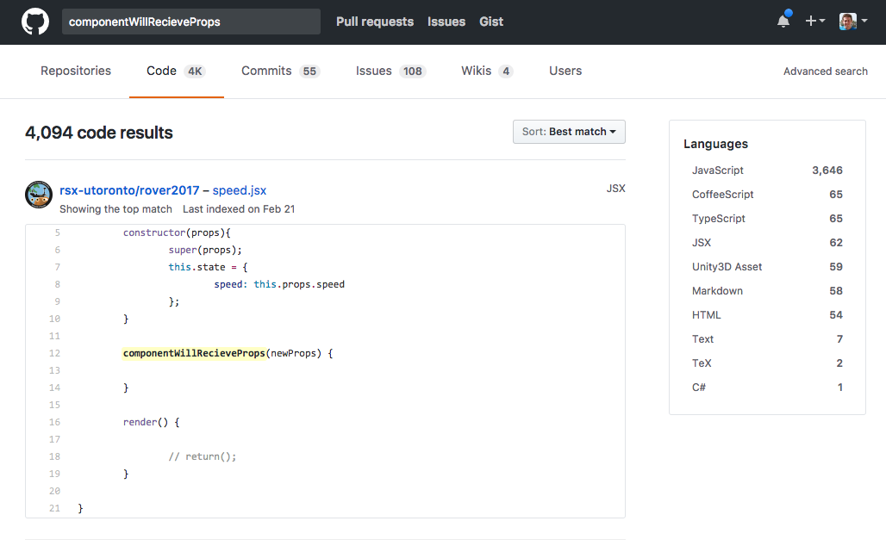
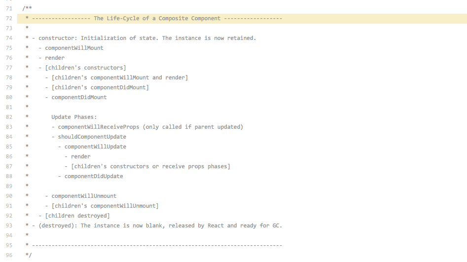

# Deep Dive on the React Lifecycle

---

# whoami

### Jonathan Creamer


---

# whoami

* Currently Senior Front End Engineer at [Lonely Planet](http://lonelyplanet.com)
* Past JavaScript Engineer appendTo
* Nashville, TN


* Love JavaScript, tweet at [@jcreamer898](http://twitter.com/jcreamer898), blog at [jonathancreamer.com](http://jonathancreamer.com)
* [Microsoft MVP](https://mvp.microsoft.com/en-us/MyProfile/Preview?previewAs=Public)

---

### Agenda

1. What is a React component?
1. Lifecycle methods
1. Use cases
1. Testing

---

### Pure Functions

A function is pure if...

> Given the same input, will always return the same output.
> Produces no side effects.
> Relies on no external mutable state.

* One way to build a React component is as a pure function

---

### Can you even Component bro?

```js
function HelloWorld({
  text
}) {
  return (
    <h1>{text}</h1>
  );
}

ReactDOM.render(<HelloWorld text="hello world" />, document.body);
```

* Might be all you need
* Simple
* State forced to higher level container components

^ Sometimes all you need is to take props and return elements  
^ You’re forced to put state management where it belongs: in higher level container components.

---

### JSX to JS

```js
function HelloWorld(_ref) {
  var text = _ref.text;

  return React.createElement(
    "h1",
    null,
    text
  );
}
```

* JSX is an abstraction over creating element trees
* Different renderers like ReactDOM
* lowercase names refer to built-in components
* Capitalized names refer to custom components

---

# React Components as Classes

```js
class HelloWorld extends React.Component {
  render() {
    const { text } = this.props;
    return (
      <h1>{text}</h1>
    );
  }
}
```

* If all you have is `render`, stay functional
* Don't screw with props, they're Read Only
* Sometimes we need some state

---

# constructor

---

### constructor aka init

```js
constructor(props) {
  super(props);
  this.state = {};
}
```

* Perform any initial setup
* Called once per mounted component
* Initialize state
* Must call `super(props)`

---

### State

* What's going on around here right now?
* Has a user clicked or typed anything?
* Any data needing to be fetched?
* Any stored information?

---

### setState

```js
class WYSIWYG extends React.Component {
  update() { /*...*/ }
  render() {
    const { text } = this.state;
    return (
      <textarea
        onChange={this.update}
        value={text}
      />
    );
  }
}
```

* Pull from `state`
* A lot of things happen when you do this...

---


### setState

```js
constructor(props) {
  super(props);

  this.state = {
    text: "",
  };

  this.update = this.update.bind(this);
}
update(e) {
  const text = e.target.value;
  this.setState({ text });
}
```

* Must `bind` for `this` to work
* After `setState`, `render` will fire
* Do NOT update state w/ `this.state.text = "foo";`

^ First lifecycle hook is constructor

---

### async setState

```js
// WRONG
this.setState({ count: this.state.count + 1 });
doSomething(this.state.count);

// RIGHT
this.setState((prevState, props) => ({
  counter: prevState.count + 1
}));
```

* Don't rely on current state

---

# componentWillMount
### aka beforeDomReady

---

### componentWillMount

* `props` and `state` both ready
* Can use for calling `setState`
* Most times just use `constructor`

---

# componentDidMount
### aka onDomReady

---
### componentDidMount

* jQuery plugin time :trollface:
* DOM is ready here
* Stand up plugins
* `ref` is now a function
* Dispatch actions

---

### componentDidMount

```js
import ace from "aceeditor";

export default class Editor extends React.Component {
  constructor() {
    super();
    this.state = { /* init state */ };
  }
  componentDidMount() {
    this.editor = ace.edit(this.$text);
  }
  render() {
    return (
      <div
        ref={(node) => this.$text = node}
      />
    )
  }
}
```

---

### componentDidMount

```js, [.highlight: 4-7]
import ace from "aceeditor";

export default class Editor extends React.Component {
  constructor() {
    super();
    this.state = {};
  }
  componentDidMount() {
    this.editor = ace.edit(this.$text);
  }
  render() {
    return (
      <div
        ref={(node) => this.$text = node}
      />
    )
  }
}
```

---

### componentDidMount

```js, [.highlight: 11-17]
import ace from "aceeditor";

export default class Editor extends React.Component {
  constructor() {
    super();
    this.state = {};
  }
  componentDidMount() {
    this.editor = ace.edit(this.$text);
  }
  render() {
    return (
      <div
        ref={(node) => this.$text = node}
      />
    )
  }
}
```
---

### componentDidMount

```js, [.highlight: 8-10]
import ace from "aceeditor";

export default class Editor extends React.Component {
  constructor() {
    super();
    this.state = {};
  }
  componentDidMount() {
    this.editor = ace.edit(this.$text);
  }
  render() {
    return (
      <div
        ref={(node) => this.$text = node}
      />
    )
  }
}
```

---

# componentWillUnmount
### aka destroy

---

### Be a good citizen

```js
componentWillUnmount() {
  this.editor.destroy();
}
```
* Remove any event handlers or plugins
* No leaks

---

### componentWillUnmount

```js
class Chat extends Component {
  constructor(props) {
    super(props);
    this.state = { messages: [] };
  }
  componentDidMount() {
    this.subscription = postal.subscribe({
      topic: "message.added",
      callback: (message) => {
        this.setState({
          messages: [...this.state.messages, message]
        })
      }
    });
  }
  componentWillUmount() {
    this.subscription.unsubscribe();
  }
  render() {
    return (
      <Messages messages={this.state.message} />
    )
  }
}
```

---

### componentWillUnmount

```js, [.highlight: 2]
class Chat extends Component {
  constructor(props) {
    super(props);
    this.state = { messages: [] };
  }
  componentDidMount() {
    this.subscription = postal.subscribe({
      topic: "message.added",
      callback: (message) => {
        this.setState({
          messages: [...this.state.messages, message]
        })
      }
    });
  }
  componentWillUmount() {
    this.subscription.unsubscribe();
  }
  render() {
    return (
      <Messages messages={this.state.message} />
    )
  }
}
```

---

### componentWillUnmount

```js, [.highlight: 19]
class Chat extends Component {
  constructor(props) {
    super(props);
    this.state = { messages: [] };
  }
  componentDidMount() {
    this.subscription = postal.subscribe({
      topic: "message.added",
      callback: (message) => {
        this.setState({
          messages: [...this.state.messages, message]
        })
      }
    });
  }
  componentWillUmount() {
    this.subscription.unsubscribe();
  }
  render() {
    return (
      <Messages messages={this.state.message} />
    )
  }
}
```

---

### componentWillUnmount

```js, [.highlight: 6]
class Chat extends Component {
  constructor(props) {
    super(props);
    this.state = { messages: [] };
  }
  componentDidMount() {
    this.subscription = postal.subscribe({
      topic: "message.added",
      callback: (message) => {
        this.setState({
          messages: [...this.state.messages, message]
        })
      }
    });
  }
  componentWillUmount() {
    this.subscription.unsubscribe();
  }
  render() {
    return (
      <Messages messages={this.state.message} />
    )
  }
}
```

---

### componentWillUnmount

```js, [.highlight: 16]
class Chat extends Component {
  constructor(props) {
    super(props);
    this.state = { messages: [] };
  }
  componentDidMount() {
    this.subscription = postal.subscribe({
      topic: "message.added",
      callback: (message) => {
        this.setState({
          messages: [...this.state.messages, message]
        })
      }
    });
  }
  componentWillUmount() {
    this.subscription.unsubscribe();
  }
  render() {
    return (
      <Messages messages={this.state.message} />
    )
  }
}
```

---

# IRL

---
### IRL


* [](https://)

---

### componentDidMount IRL

```js
export default class PoiDetail {
  componentDidMount() {
    if (!this.props.poi) {
      this.fetchPoi(this.props.params.id);
    }

    if (!this.props.related) {
      this.fetchRelated(this.props.params.id);
    }
  }
}
```

* `List` is mounted on load, `Poi` gets mounted on route change
* Use `react-router` params to get ID

---

### componentDidMount IRL

```js
import { connect } from "react-redux";
import { bindActionCreators } from "redux";

const mapStateToProps = state => ({
  poi: state.poi,
  related: state.related
});
const mapDispatchToProps = (dispatch) => ({
  ...bindActionCreators(actions, dispatch)
});
const connected = connect(mapStateToProps, mapDispatchToProps)(Poi);
export { connected };
```

* Setup the state, and props

---

# componentWillReceiveProps
### aka onChange

---

### I before E...



---

### componentWillReceiveProps

* `props` have changed
* NOT called on initial render
* Update `state` based on `props`
* Dispatch actions
* Be careful, can cause loops i.e. don't compare objects
* Update state if props don't match
* Very useful in React Router SPA

---

### componentWillReceiveProps

```js
class AvatarUploader extends Component {
  constructor(props) {
    super(props);
    this.state = { src: props.src };
  }
  componentWillReceiveProps(nextProps) {
    if (nextProps.src !== this.props.src) {
      this.setState({
        src: nextProps.src,
      });
    }
  }
  uploadFiles() {
    this.props.upload()
  }
  render() { /* ... */ }
}
```

* Useful when `state` is set with a `prop`.
* [Anti-pattern alert](https://medium.com/@justintulk/react-anti-patterns-props-in-initial-state-28687846cc2e)!

---

### componentWillReceiveProps

```js
class Editor extends PureComponent {
  upload(files) {
    this.props.dispatch(uploadAction(files));
  }
  render() {
    const { image } = this.props;
    return (
      <AvatarUploader
        src={image}
        upload={this.upload}
      />
    )
  }
}
```
```js
const mapStateToProps = (state) => ({ image: state.image })
export default connect(mapStateToProps)(Editor);
```

* `image` gets passed in to `AvatarUploader`
* Causes `componentWillReceiveProps` to fire

---

### React Router

```js
class SightComponent extends Component {
  render() {
    return (
      <div>
        <Link to="/a/poi-sig/381139/362228">Country Music Hall of Fame</Link>
      </div>
    )
  }
}
```

* [Country Music Hall of Fame](http://www.lonelyplanet.com/usa/nashville/attractions/country-music-hall-of-fame-museum/a/poi-sig/381139/362228)
* If a component is mounted already

---

### React Router

```js
componentWillReceiveProps(nextProps) {
  const { id: currentId } = this.props.params;
  const { id: nextId } = nextProps.params;

  if (currentId !== nextId) {
    this.props.fetchPoi(nextId);
  }
}
```

* Compare last id to current id
* Name variables for readability

---

### lOOps

```js
componentWillReceiveProps(nextProps) {
  const { id: currentId } = this.props.params;
  const { id: nextId } = nextProps.poi;

  if (currentId !== nextId) {
    this.props.fetchPoi(nextId);
  }
}
```

* Next `poi.id` won't match

---

### loops


---

# shouldComponentUpdate
### aka shouldRender

---

### shouldComponentUpdate

```js
shouldComponentUpdate(nextProps, nextState) {
  return shallowCompare(nextProps, nextState);
}
```
```js
export class Counter extends React.PureComponent {
  // ...
}
```

* Tell the component whether or not to render
* Can [increase performance](https://facebook.github.io/react/docs/optimizing-performance.html)
* Used to call `shallowCompare`
* MOST of the time, use `React.PureComponent`

---

### shouldComponentUpdate

```js
shouldComponentUpdate(nextProps) {
  return nextProps.poi.id !== this.props.poi.id;
}
```

* If you need fine grain control
* Parent could change a prop
* Return false will cancel...
* `componentWillUpdate`, `render`, and `componentDidUpdate`

---

# componentWillUpdate
### aka beforeRender

---

### componentWillUpdate


* Called BEFORE render like when `setState` called
* Do NOT call `setState` here
* Useful for triggering CSS animations or transitions

---

---

# componentDidUpdate
### aka afterRender

---

### componentDidUpdate

```js
componentDidUpdate(prevProps) {
  if (prevProps.poi.id !== this.poi.id) {
    window.scrollTop = 0;
    this.props.pageView();
  }
}
```

* Gives you previous props `prevProps` to compare before actions
* Called AFTER render
* Update the DOM

---

# Full Example

---

```js
export default class PoiDetail {
  constructor(props) {
    // ...
  }
  hasPoiUpdated() {}
  componentDidMount() {
    this.subscription = postal.subscribe({ /* ... */ })
  }
  componentWillReceiveProps(nextProps) {
    if (nextProps.params.id !== this.props.params.id) {
      this.props.fetchPoi(nextProps.params.id);
    }
  }
  shouldComponentUpdate(nextProps) {
    return nextProps.poi.id !== this.props.poi.id;
  }
  componentWillUpdate(nextProps, nextState) { /* ... */ }
  componentDidUpdate(prevProps) {
    const isNewPoi = prevProps.poi.id !== this.props.poi.id;
    if (isNewPoi) {
      window.scrollTop = 0;
    }
  }
  componentWillUnmount() {
    this.subscription.unsubscribe();
  }
  render() { /* ... */ }
}
```
---

```js, [.highlight: 2]
export default class PoiDetail {
  constructor(props) {
    // ...
  }
  hasPoiUpdated() {}
  componentDidMount() {
    this.subscription = postal.subscribe({ /* ... */ })
  }
  componentWillReceiveProps(nextProps) {
    if (nextProps.params.id !== this.props.params.id) {
      this.props.fetchPoi(nextProps.params.id);
    }
  }
  shouldComponentUpdate(nextProps) {
    return nextProps.poi.id !== this.props.poi.id;
  }
  componentWillUpdate(nextProps, nextState) { /* ... */ }
  componentDidUpdate(prevProps) {
    const isNewPoi = prevProps.poi.id !== this.props.poi.id;
    if (isNewPoi) {
      window.scrollTop = 0;
    }
  }
  componentWillUnmount() {
    this.subscription.unsubscribe();
  }
  render() { /* ... */ }
}
```

---

```js, [.highlight: 27]
export default class PoiDetail {
  constructor(props) {
    // ...
  }
  hasPoiUpdated() {}
  componentDidMount() {
    this.subscription = postal.subscribe({ /* ... */ })
  }
  componentWillReceiveProps(nextProps) {
    if (nextProps.params.id !== this.props.params.id) {
      this.props.fetchPoi(nextProps.params.id);
    }
  }
  shouldComponentUpdate(nextProps) {
    return nextProps.poi.id !== this.props.poi.id;
  }
  componentWillUpdate(nextProps, nextState) { /* ... */ }
  componentDidUpdate(prevProps) {
    const isNewPoi = prevProps.poi.id !== this.props.poi.id;
    if (isNewPoi) {
      window.scrollTop = 0;
    }
  }
  componentWillUnmount() {
    this.subscription.unsubscribe();
  }
  render() { /* ... */ }
}
```


---

```js, [.highlight: 6-8]
export default class PoiDetail {
  constructor(props) {
    // ...
  }
  hasPoiUpdated() {}
  componentDidMount() {
    this.subscription = postal.subscribe({ /* ... */ })
  }
  componentWillReceiveProps(nextProps) {
    if (nextProps.params.id !== this.props.params.id) {
      this.props.fetchPoi(nextProps.params.id);
    }
  }
  shouldComponentUpdate(nextProps) {
    return nextProps.poi.id !== this.props.poi.id;
  }
  componentWillUpdate(nextProps, nextState) { /* ... */ }
  componentDidUpdate(prevProps) {
    const isNewPoi = prevProps.poi.id !== this.props.poi.id;
    if (isNewPoi) {
      window.scrollTop = 0;
    }
  }
  componentWillUnmount() {
    this.subscription.unsubscribe();
  }
  render() { /* ... */ }
}
```

---

### React Router

```js
render() {
  return (
    <Link to={poiLink(1234, 362228)} />
  )
}
```
* Click a link
* Will pass props down to `PoiDetail`

---

```js, [.highlight: 9-13]
export default class PoiDetail {
  constructor(props) {
    // ...
  }
  hasPoiUpdated() {}
  componentDidMount() {
    this.subscription = postal.subscribe({ /* ... */ })
  }
  componentWillReceiveProps(nextProps) {
    if (nextProps.params.id !== this.props.params.id) {
      this.props.fetchPoi(nextProps.params.id);
    }
  }
  shouldComponentUpdate(nextProps) {
    return nextProps.poi.id !== this.props.poi.id;
  }
  componentWillUpdate(nextProps, nextState) { /* ... */ }
  componentDidUpdate(prevProps) {
    const isNewPoi = prevProps.poi.id !== this.props.poi.id;
    if (isNewPoi) {
      window.scrollTop = 0;
    }
  }
  componentWillUnmount() {
    this.subscription.unsubscribe();
  }
  render() { /* ... */ }
}
```

---

```js, [.highlight: 14-16]
export default class PoiDetail {
  constructor(props) {
    // ...
  }
  hasPoiUpdated() {}
  componentDidMount() {
    this.subscription = postal.subscribe({ /* ... */ })
  }
  componentWillReceiveProps(nextProps) {
    if (nextProps.params.id !== this.props.params.id) {
      this.props.fetchPoi(nextProps.params.id);
    }
  }
  shouldComponentUpdate(nextProps) {
    return nextProps.poi.id !== this.props.poi.id;
  }
  componentWillUpdate(nextProps, nextState) { /* ... */ }
  componentDidUpdate(prevProps) {
    const isNewPoi = prevProps.poi.id !== this.props.poi.id;
    if (isNewPoi) {
      window.scrollTop = 0;
    }
  }
  componentWillUnmount() {
    this.subscription.unsubscribe();
  }
  render() { /* ... */ }
}
```

---

### Fetching...


---

```js, [.highlight: 9-13]
export default class PoiDetail {
  constructor(props) {
    // ...
  }
  hasPoiUpdated() {}
  componentDidMount() {
    this.subscription = postal.subscribe({ /* ... */ })
  }
  componentWillReceiveProps(nextProps) {
    if (nextProps.params.id !== this.props.params.id) {
      this.props.fetchPoi(nextProps.params.id);
    }
  }
  shouldComponentUpdate(nextProps) {
    return nextProps.poi.id !== this.props.poi.id;
  }
  componentWillUpdate(nextProps, nextState) { /* ... */ }
  componentDidUpdate(prevProps) {
    const isNewPoi = prevProps.poi.id !== this.props.poi.id;
    if (isNewPoi) {
      window.scrollTop = 0;
    }
  }
  componentWillUnmount() {
    this.subscription.unsubscribe();
  }
  render() { /* ... */ }
}
```

---

```js, [.highlight: 14-16]
export default class PoiDetail {
  constructor(props) {
    // ...
  }
  hasPoiUpdated() {}
  componentDidMount() {
    this.subscription = postal.subscribe({ /* ... */ })
  }
  componentWillReceiveProps(nextProps) {
    if (nextProps.params.id !== this.props.params.id) {
      this.props.fetchPoi(nextProps.params.id);
    }
  }
  shouldComponentUpdate(nextProps) {
    return nextProps.poi.id !== this.props.poi.id;
  }
  componentWillUpdate(nextProps, nextState) { /* ... */ }
  componentDidUpdate(prevProps) {
    const isNewPoi = prevProps.poi.id !== this.props.poi.id;
    if (isNewPoi) {
      window.scrollTop = 0;
    }
  }
  componentWillUnmount() {
    this.subscription.unsubscribe();
  }
  render() { /* ... */ }
}
```

---

```js, [.highlight: 17]
export default class PoiDetail {
  constructor(props) {
    // ...
  }
  hasPoiUpdated() {}
  componentDidMount() {
    this.subscription = postal.subscribe({ /* ... */ })
  }
  componentWillReceiveProps(nextProps) {
    if (nextProps.params.id !== this.props.params.id) {
      this.props.fetchPoi(nextProps.params.id);
    }
  }
  shouldComponentUpdate(nextProps) {
    return nextProps.poi.id !== this.props.poi.id;
  }
  componentWillUpdate(nextProps, nextState) { /* ... */ }
  componentDidUpdate(prevProps) {
    const isNewPoi = prevProps.poi.id !== this.props.poi.id;
    if (isNewPoi) {
      window.scrollTop = 0;
    }
  }
  componentWillUnmount() {
    this.subscription.unsubscribe();
  }
  render() { /* ... */ }
}
```

---

```js, [.highlight: 27]
export default class PoiDetail {
  constructor(props) {
    // ...
  }
  hasPoiUpdated() {}
  componentDidMount() {
    this.subscription = postal.subscribe({ /* ... */ })
  }
  componentWillReceiveProps(nextProps) {
    if (nextProps.params.id !== this.props.params.id) {
      this.props.fetchPoi(nextProps.params.id);
    }
  }
  shouldComponentUpdate(nextProps) {
    return nextProps.poi.id !== this.props.poi.id;
  }
  componentWillUpdate(nextProps, nextState) { /* ... */ }
  componentDidUpdate(prevProps) {
    const isNewPoi = prevProps.poi.id !== this.props.poi.id;
    if (isNewPoi) {
      window.scrollTop = 0;
    }
  }
  componentWillUnmount() {
    this.subscription.unsubscribe();
  }
  render() { /* ... */ }
}
```

---

```js, [.highlight: 18-23]
export default class PoiDetail {
  constructor(props) {
    // ...
  }
  hasPoiUpdated() {}
  componentDidMount() {
    this.subscription = postal.subscribe({ /* ... */ })
  }
  componentWillReceiveProps(nextProps) {
    if (nextProps.params.id !== this.props.params.id) {
      this.props.fetchPoi(nextProps.params.id);
    }
  }
  shouldComponentUpdate(nextProps) {
    return nextProps.poi.id !== this.props.poi.id;
  }
  componentWillUpdate(nextProps, nextState) { /* ... */ }
  componentDidUpdate(prevProps) {
    const isNewPoi = prevProps.poi.id !== this.props.poi.id;
    if (isNewPoi) {
      window.scrollTop = 0;
    }
  }
  componentWillUnmount() {
    this.subscription.unsubscribe();
  }
  render() { /* ... */ }
}
```

---

# tldr;

---

| Name of thing             | Sorta like...    | Mounted? | Can you even setState? | What would you say... ya do here?                                     | 
|---------------------------|------------------|----------|------------------------|-----------------------------------------------------------------------| 
| constructor               | initialize()     | nope     | nope                   | init stuff NO side effects                                            | 
| componentWillMount        | beforeDomReady() | nope     | yeah but don't         | Only needed in createClass now use constructor for most things        | 
| render                    | render           | nope     | please no              | render stuff and don't set any state please                           | 
| componentDidMount         | domReady()       | yup      | yup                    | DOM is a go init jQuery plugins dispatch stuff                        | 
| componentWillReceiveProps | onChange()       | yup      | yup                    | Props changed feel free to update state if needed                     | 
| componentWillUpdate       | beforeRender()   | yup      | nope                   | The props or state changed need to do anything else before rendering? | 
| shouldComponentUpdate     | shouldRender()   | yup      | nope                   | So yeah something changed but do we REALLY need to update?            | 
| componentDidUpdate        | afterRender()    | yup      | yup                    | Great success we've rendered a thing... anything else?                | 
| componentWillUnmount      | destroy()        | too late | too late               | Only you can prevent memory leaks aka unbind things                   | 

---



---


* [https://tylermcginnis.com/an-introduction-to-life-cycle-events-in-react-js/](https://tylermcginnis.com/an-introduction-to-life-cycle-events-in-react-js/)

---


# Testing

---

### Testing

```
npm i install -S jest enzyme
```

* Jest for suite
* Enzyme for sweet
* Super important to test
* Always test logic
* Use [mount](https://github.com/airbnb/enzyme/blob/master/docs/api/mount.md) to run JSDom

---

### Testing willMount

```js
describe("Detail Page", () => {
  it("should fetch a page if there isn't one loaded", () => {
    const fetch = jest.fn();
    const wrapper = mount(
      <Details
        poi={null}
        fetchPoi={fetch}
      />
    );

    expect(fetch).toHaveBeenCalled();
  });
});
```

^ Create a mock fetch
^ Assert with `toHaveBeenCalled` 

---

### Testing willReceiveProps

```js
describe("Detail Page", () => {
  it("should fetch a new page", () => {
    const fetch = jest.fn();
    const wrapper = mount(
      <Details
        poi={{ id: 1}}
        params={{
          id: 1
        }}
        fetchPoi={fetch}
      />
    );
    wrapper.setProps({
      params: { id: 2 }
    });

    expect(fetch).toHaveBeenCalled();
  });
});
```

* Use `setProps`

---

### Additional Resources

* [https://gist.github.com/jcreamer898/aeaf4b7a08b9871c3a48ad4bb7ccb35c](https://gist.github.com/jcreamer898/aeaf4b7a08b9871c3a48ad4bb7ccb35c)
* [https://engineering.musefind.com/react-lifecycle-methods-how-and-when-to-use-them-2111a1b692b1](https://engineering.musefind.com/react-lifecycle-methods-how-and-when-to-use-them-2111a1b692b1)
* [https://developmentarc.gitbooks.io/react-indepth/content/life_cycle/lifecycle_methods_overview.html](https://developmentarc.gitbooks.io/react-indepth/content/life_cycle/lifecycle_methods_overview.html)
* [http://busypeoples.github.io/post/react-component-lifecycle/](http://busypeoples.github.io/post/react-component-lifecycle/)

---

# Thanks!


### [@jcreamer898](http://twitter.com/jcreamer898)
### [jonathancreamer.com](http://jonathancreamer.com)
